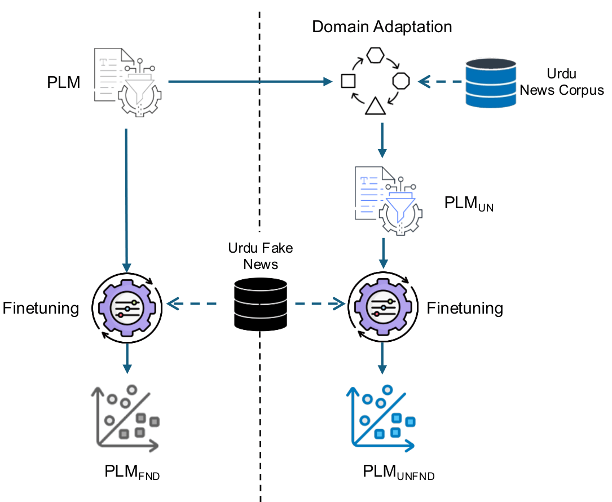

# Fake News Classification in Urdu through Domain Adaptation of Multilingual Language Models

This repository contains the code, datasets, trained models, and supplementary experimental results for **"Fake News Classification in Urdu through Domain Adaptation of Multilingual Language Models,"** accepted at the **33rd International Conference on Neural Information Processing (ICONIP 2026)**.

The work investigates domain-adaptive pretraining of multilingual language models for Urdu fake news classification. In particular, XLM-R and multilingual BERT (mBERT) are further pretrained on a large Urdu news corpus using masked language modeling (MLM) and then fine-tuned on four Urdu fake news datasets.

The repository provides scripts for reproducing both the domain-adaptation and downstream classification experiments reported in the paper.

---

## Methodology

The proposed framework consists of two main stages:

1. **Domain Adaptation** &mdash; XLM-R and mBERT are further pretrained on the Urdu News Dataset 1M using masked language modeling.
2. **Fake News Classification** &mdash; the vanilla and domain-adapted models are fine-tuned and evaluated on four Urdu fake news datasets.

The proposed domain-adaptation and fine-tuning framework is illustrated below:

<p align="center">
  
</p>

---

## Repository Structure

```text
DomainAdaptation/
├── assets/
│   ├── framework.pdf
│   └── supplementary training curves
│
├── classification/
│   └── train_classifier.py
│
├── datasets/
│   ├── new_dataset1.xlsx
│   ├── new_dataset2.xlsx
│   ├── new_dataset3.xlsx
│   ├── new_dataset4.xlsx
│   └── README.md
│
├── domain_adaptation/
│   ├── train_mbert.py
│   └── train_xlmr.py
│
├── .gitignore
├── requirements.txt
└── README.md
```

---

## Installation

Clone the repository:

```bash
git clone https://github.com/zainali93/DomainAdaptation.git
cd DomainAdaptation
```

The experiments were conducted using Python 3.11 and TensorFlow 2.15. A Conda environment is recommended for reproducing the software environment.

```bash
conda create -n domainadaptation python=3.11
conda activate domainadaptation
pip install -r requirements.txt
```

All commands below assume that they are executed from the root directory of the repository.

Domain-adaptive pretraining is computationally intensive, and a CUDA-enabled GPU is recommended. TensorFlow will automatically use compatible GPU devices available in the environment.

---

## Datasets

### Downstream Fake News Datasets

Four Urdu fake news datasets are included in the `datasets/` directory in a standardized format containing `text` and `label` columns.

| File | Dataset | Description |
|---|---|---|
| `new_dataset1.xlsx` | ATG | Ax-to-Grind |
| `new_dataset2.xlsx` | UFN23 | UrduFakeNews 2023 |
| `new_dataset3.xlsx` | UFN21 | UrduFakeNews 2021 |
| `new_dataset4.xlsx` | UFake21 | UrduFake 2021 |

The labels are encoded as:

- `0` &mdash; Real news
- `1` &mdash; Fake news

ATG and UFN23 primarily contain short news texts, whereas UFN21 and UFake21 contain longer news articles.

### Urdu News Dataset 1M

The large-scale Urdu news corpus used for domain-adaptive pretraining is not redistributed in this repository.

The experiments use the **Urdu News Dataset 1M**, containing approximately 1.04 million Urdu news articles.

The dataset can be downloaded from Kaggle:

[Urdu News Dataset](https://www.kaggle.com/datasets/saurabhshahane/urdu-news-dataset)

After downloading, place the CSV file at:

```text
datasets/Urdu-News-Dataset-1M.csv
```

The domain-adaptation scripts automatically construct the 80/10/10 train/validation/test split used by the training pipeline.

For further details regarding the construction, collection, and characteristics of these datasets, please refer to the original dataset publications cited in our paper.

---

## Domain-Adaptive Pretraining

Domain adaptation is performed by continuing masked language model pretraining of XLM-R and mBERT on the Urdu News Dataset 1M.

The common training configuration is:

| Parameter | Value |
|---|---|
| Objective | Masked Language Modeling |
| MLM probability | 0.15 |
| Tokenization length | 256 |
| Training chunk length | 128 |
| Batch size | 16 |
| Epochs | 7 |
| Learning rate | 1e-4 |
| Warm-up steps | 1,000 |
| Weight decay | 0.01 |

The corpus is divided into 80% training, 10% validation, and 10% test data. Tokenized documents are concatenated and divided into sequences of 128 tokens, with incomplete final chunks discarded.

### XLM-R

To domain-adapt `xlm-roberta-base`:

```bash
python domain_adaptation/train_xlmr.py
```

The resulting model and tokenizer are saved by default to:

```text
models/xlmr_urdu_news/
```

### mBERT

To domain-adapt `google-bert/bert-base-multilingual-cased`:

```bash
python domain_adaptation/train_mbert.py
```

The resulting model and tokenizer are saved by default to:

```text
models/mbert_urdu_news/
```

Both scripts also evaluate the resulting masked language model and report its
perplexity.

---

## Fake News Classification

The downstream classification experiments can be reproduced using:

```bash
python classification/train_classifier.py
```

The dataset and language model are selected at the beginning of `train_classifier.py`.

For example:

```python
DATASET_NAME = "ATG"
MODEL_NAME = "xlm-roberta-base"
```

### Dataset Options

```python
DATASET_NAME = "ATG"
DATASET_NAME = "UFN23"
DATASET_NAME = "UFN21"
DATASET_NAME = "UFake21"
```

The classification pipeline uses a maximum sequence length of **170 tokens** for the shorter ATG and UFN23 datasets and **512 tokens** for the longer UFN21 and UFake21 datasets.

### Model Options

The vanilla models can be selected using:

```python
MODEL_NAME = "xlm-roberta-base"
```

or:

```python
MODEL_NAME = "google-bert/bert-base-multilingual-cased"
```

To evaluate models produced by the domain-adaptation scripts:

```python
MODEL_NAME = "models/xlmr_urdu_news"
```

or:

```python
MODEL_NAME = "models/mbert_urdu_news"
```

---

## Classification Architecture and Training

For downstream classification, the pretrained language model representation is passed through a task-specific classification network consisting of:

```text
Pretrained Language Model
        ↓
Dense (256, ReLU)
        ↓
Batch Normalization
        ↓
Dense (128, ReLU)
        ↓
Batch Normalization
        ↓
Dropout (0.5)
        ↓
Sigmoid Output
```

Each dataset is divided into:

- **68% training**
- **12% validation**
- **20% test**

Training is performed in two stages.

### Stage 1 &mdash; Frozen Encoder

The pretrained language model is frozen while the task-specific classification layers are trained for 20 epochs using a learning rate of `1e-5`.

### Stage 2 &mdash; Unfrozen Encoder

The best model from the frozen stage is restored; the language model is unfrozen, and the complete network is fine-tuned for another 20 epochs using a reduced learning rate of `1e-6`.

Binary cross-entropy is used as the classification loss.

---

## Multi-Seed Evaluation

The classification script evaluates each model-dataset configuration over five fixed random seeds:

```python
SEEDS = [42, 99, 1005, 2023, 2024]
```

For each run, the script reports:

- Accuracy
- Precision
- Recall
- F1-score

Aggregate results are reported as **mean ± standard deviation** across the five runs.

Experiment outputs and checkpoints are written to the `outputs/` directory, including per-seed results and an aggregate summary.

---

## Trained Models

The domain-adapted models are also available on Hugging Face:

- [XLM-R &mdash; Domain Adapted on Urdu News 1M](https://huggingface.co/ma1993/xlm-roberta-base-Urdu1M-finetuned)
- [mBERT &mdash; Domain Adapted on Urdu News 1M](https://huggingface.co/ma1993/mBERT-Urdu1M-finetuned)

These checkpoints can be used directly instead of rerunning domain-adaptive
pretraining.

---

## Supplementary Results

Additional training curves are provided in the [`assets/`](assets/) directory. These figures supplement the results reported in the paper and provide the training and validation dynamics of the domain-adaptation and classification experiments.

### XLM-R Classification

| Dataset | Accuracy | Loss |
|---|---|---|
| UFN23 | [Accuracy](assets/xlmr_ufn2023_accuracy.pdf) | [Loss](assets/xlmr_ufn2023_loss.pdf) |
| UFN21 | [Accuracy](assets/xlmr_ufn2021_accuracy.pdf) | [Loss](assets/xlmr_ufn2021_loss.pdf) |
| UFake21 | [Accuracy](assets/xlmr_urdufake2021_accuracy.pdf) | [Loss](assets/xlmr_urdufake2021_loss.pdf) |

### mBERT Domain Adaptation

- [Training Loss](assets/mbert_domain_training_loss.pdf)
- [Validation Loss](assets/mbert_domain_validation_loss.pdf)

### mBERT Classification

| Dataset | Accuracy | Loss |
|---|---|---|
| ATG | [Accuracy](assets/mbert_atg_accuracy.pdf) | [Loss](assets/mbert_atg_loss.pdf) |
| UFN23 | [Accuracy](assets/mbert_ufn2023_accuracy.pdf) | [Loss](assets/mbert_ufn2023_loss.pdf) |
| UFN21 | [Accuracy](assets/mbert_ufn2021_accuracy.pdf) | [Loss](assets/mbert_ufn2021_loss.pdf) |
| UFake21 | [Accuracy](assets/mbert_urdufake2021_accuracy.pdf) | [Loss](assets/mbert_urdufake2021_loss.pdf) |

---

## Citation

If you use this work, please cite:

```bibtex
@inproceedings{ali2026fake,
  title     = {Fake News Classification in Urdu through Domain Adaptation of Multilingual Language Models},
  author    = {Ali, Muhammad Zain and Smith, Tony and Pfahringer, Bernhard},
  booktitle = {International Conference on Neural Information Processing},
  year      = {2026}
}
```

The citation will be updated with the final proceedings information when available.

---

## License

This project is licensed under the MIT License. See the [LICENSE](https://github.com/zainali93/DomainAdaptation/tree/master?tab=MIT-1-ov-file) file for details.
